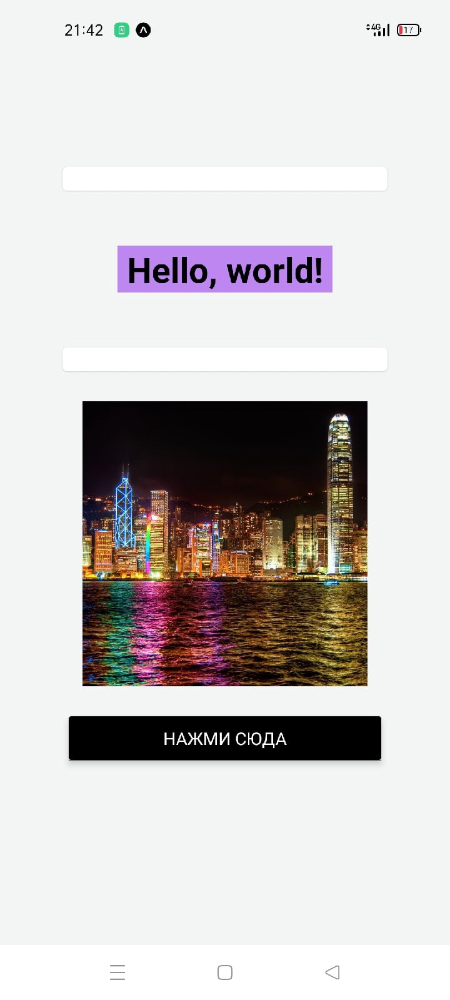
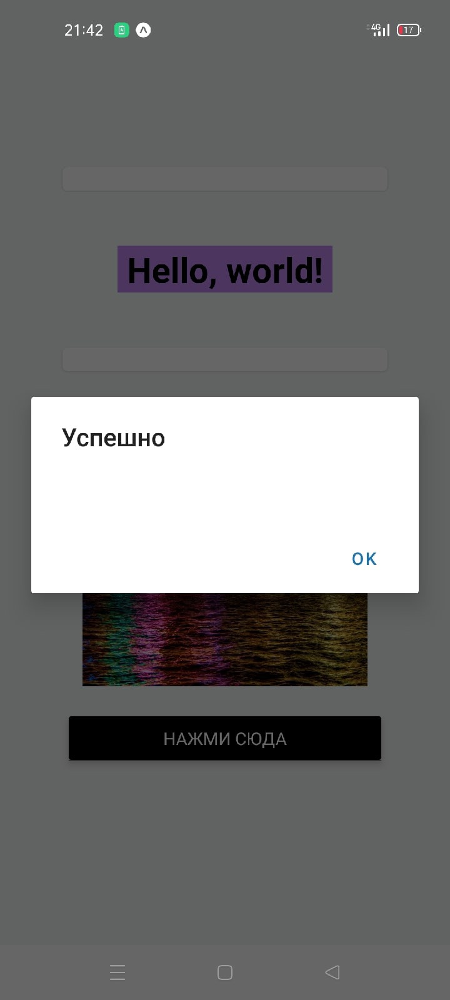

# Подготовка среды. Hello World на React Native

## Цель работы

- Получить навыки настройки среды для отладки приложений на React Native.

## Задания для выполнения

- Перейдите на сайт https://snack.expo.io/ и установите на телефон приложение Expo. Отсканируйте QR-код и синхронизируйте Expo-редактор и ваше устройство.
- Используя стрелочную функцию (или класс), задайте компонент, который выведет на экран вашего устройства Hello World.

## Контрольные вопросы

- Можно ли писать в React Native все на JS?
Да, можно, но интерфейс остается полностью нативным.

- Есть ли в React Native объект кнопка?
Да, есть, для того, чтобы использовать, нужно импортировать: import { Button } from 'react-native'. Так же можно задать текст, цвет и прочие параметры.
 
# Результат

